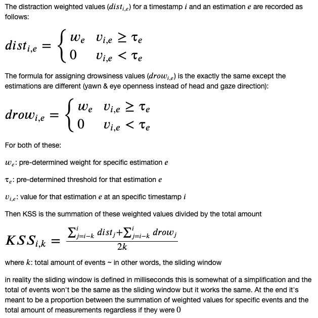

# Driver Drowsiness and Distraction Estimator (DD&D Estimator) with OpenCV 

## What is DD&D Estimator?
----
A python class to gauge in real time the level of drowsiness and distraction of a driver using OpenCV, Dlib, a pre-trained model and a number of computer vision techniques. 

It's the first step of a bigger project that involves 3 repositories aimed at producing a good prototype to tackle driver drowsiness and distraction.


## How does it work?
----
 It focuses on detecting any or all of the following 3 events:

- Head movement beyond a threshold → distraction
- Eye gaze beyond a threshold → distraction
- Yawn beyond a threshold → drowsiness
- Eye closure beyond a threshold → drowsiness

and then with this estimating a level of distraction from 1-10 (modelled after the subjective "KSS" alertness scale) using the following formula:



The idea is to have something measurable that can be used to alert the driver (or even used for training purposes).


## State of the Repo
----
This repo was committed after project was finished so there's no plans of maintaining it but we'd love to get your thoughts. It's by no means perfect since the underlying model has limitations with occluded faces and is not illumination and angle invariant. Also, there are issues with interference from other passenger or camera closeness or facial hair. This is why another dataset was trained on producing a slightly better model (in another repo) but it's a good start.


## Quick Start
----

### 1. Clone or download repo

```
git clone https://github.com/smasis001/ddd-estimator-opencv
```

### 2. Install the [requirements](requirements.txt)

### 3. Run one of the demos

the demo for live testing using your device’s front-facing camera

```
python demo1.pyx
```

or the demo for testing using a video file

```
python demo2.pyx /path/to/video.avi
```

They both have the same command line arguments:

| Command | Meaning |
|:---:|:-------------|
|'p'| Show facial landmarks 
|'b'| Show bounding cube used for head pose estimation
|'g'| Show gaze line used for gaze direction estimation
|'e'| Show eye info used for eye openness estimation
|'m'| Show mouth info used for yawn estimation
|'d'| Show drowsiness & distraction info used for calculating KSS (active by default)
|'n'| Show nothing
|'r'| Refresh/clear the frame of all info back to defaults
|'l'| Save log file
|'q'| Quit the program
|‘h’| Help ~ show this information

#### 4. Batch Processing 

if you want to calculate some distraction or drowsiness metric over time for a folder of video files then this script will get the job done and output csv files with the same name of every video file

```
python batch_process.pyx /path/to/videos/
```

The dataset we used for testing can be found [here](http://www.site.uottawa.ca/~shervin/yawning/). There's also a couple of python notebooks used during the data exploration and testing phases in the [test](tests/) folder.

## Authors
----
[Serg Masis](https://github.com/smasis001)

[Jay Rodge](https://github.com/jayrodge)


## References
----
- V. Kazemi, J. Sullivan, One millisecond face alignment with an ensemble of regression trees, IEEE Conference on Computer Vision and Pattern Recognition (CVPR), IEEE Computer Society, 2014, p. 1867-1874 (ISBN: 978-1-4799-5118-5)

- Shahid A., Wilkinson K., Marcu S., Shapiro C.M. (2011) Karolinska Sleepiness Scale (KSS). In: Shahid A., Wilkinson K., Marcu S., Shapiro C. (eds) STOP, THAT and One Hundred Other Sleep Scales. Springer, New York, NY 

- S. Abtahi, M. Omidyeganeh, S. Shirmohammadi, and B. Hariri, “YawDD: A Yawning Detection Dataset”, Proc. ACM Multimedia Systems, Singapore, March 19 -21 2014, pp. 24-28. DOI: [10.1145/2557642.2563678](http://dx.doi.org/10.1145/2557642.2563678)
